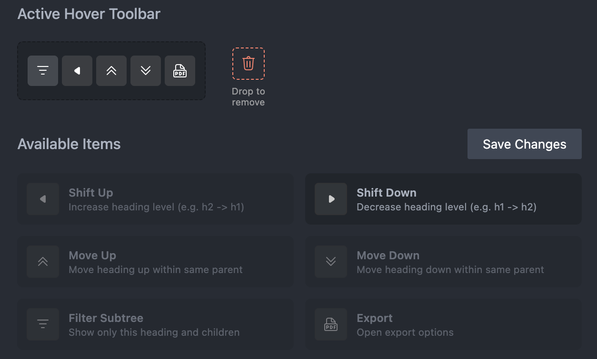

[English Guide](#english-guide) | [Github Repo](https://github.com/ffy6511/Adjust-heading-in-tree.git)

  

Adjust Heading in Tree 是一款针对 Markdown 与 Typst 文档的 VS Code 扩展，提供导航树、拖拽重排、批量层级调整与块级标签机制，帮助你像操作“块”一样管理整段内容。

## ✨️ 功能特性

- **块级标签**：使用`Tag`来组织管理您的文件! 为标题块添加标签，支持全局/当前文件切换、搜索、多选, 并可在 Tag 管理面板中自定义颜色、图标等；

  

- **标题导航与筛选**：侧边栏展示层级树，支持展开/折叠/点击定位，一键控制最大展开层级. 想要深入钻研某一区域?可以选中区域单独展示；
- **拖拽与同级重排**：拖动标题即可连同子树迁移位置，同级内可用内联按钮或快捷键快速上/下移，保持结构一致；
- **批量层级调整**：一键整体提升或降低选中标题及其子树的层级；
- **子树导出**：将选中的标题子树导出为 PDF 或 PNG（需 Tinymist），便于分享或后续处理。

## 自定义操作

### 个性化编辑您的 Tag 样式

在 Panel 中自定义您的 tag 名称、icon、颜色以及...显示优先级!

  

### 将您的常用操作固定到 hover 栏

  

现在您可以自定义hover到item上的Toolbar,通过拖拽来添加、删除和排序. 构建自己的工作区!

### 使用快捷键快捷操作

| 操作              | Windows / Linux    | macOS             |
| ----------------- | ------------------ | ----------------- |
| 提升标题层级      | `Ctrl + Shift + ←` | `Cmd + Shift + ←` |
| 降低标题层级      | `Ctrl + Shift + →` | `Cmd + Shift + →` |
| 向上移动（同级）  | `Ctrl + Shift + ↑` | `Cmd + Shift + ↑` |
| 向下移动（同级）  | `Ctrl + Shift + ↓` | `Cmd + Shift + ↓` |
| 显示 / 隐藏导航栏 | `Ctrl + Shift + T` | `Cmd + Shift + T` |

> 可在 VS Code `Preferences → Keyboard Shortcuts` 中自定义。“TOC Help” 按钮可快速打开对应设置。

## 许可

MIT License

# English Guide

Adjust Heading in Tree is a VS Code extension for Markdown and Typst documents. It provides navigation trees, drag-and-drop rearrangements, batch hierarchy adjustments, and block-level tagging so you can manage entire sections like modular blocks.

## ✨️ Features

- **Block tags / Tag View**: Organize with tags; pin key tags, auto-fill the list when pins are fewer than the limit, toggle global/current-file scope, search, multi-select, and remove references. Customize colors/icons/pin limit in the Tag Definitions panel.

  

- **Navigation & filtering**: Sidebar tree for Markdown `#` and Typst `=` with expand/collapse/jump, max-depth control, and quick filters to subtree or ancestor scopes.
- **Drag and reorder**: Drag a heading to move its entire subtree; reorder siblings via inline buttons or shortcuts.
- **Batch level shift**: Promote or demote selected headings and their subtrees together.
- **Subtree export**: Export a heading subtree as PDF or PNG (Tinymist required) for sharing or further processing.

## Customize

### Personalize your tag styles

Use the panel to set tag names, icons, colors, and display priority.

  

### Pin common actions to the hover bar

  

Customize the hover toolbar shown on items: drag to add, remove, and reorder buttons to build your workspace.

### Shortcuts

| Action                 | Windows / Linux    | macOS             |
| ---------------------- | ------------------ | ----------------- |
| Promote heading level  | `Ctrl + Shift + ←` | `Cmd + Shift + ←` |
| Demote heading level   | `Ctrl + Shift + →` | `Cmd + Shift + →` |
| Move up (same level)   | `Ctrl + Shift + ↑` | `Cmd + Shift + ↑` |
| Move down (same level) | `Ctrl + Shift + ↓` | `Cmd + Shift + ↓` |
| Toggle tree visibility | `Ctrl + Shift + T` | `Cmd + Shift + T` |

> All shortcuts can be customized via VS Code `Preferences → Keyboard Shortcuts`. The "TOC Help" command opens the relevant settings instantly.

### License

MIT License
