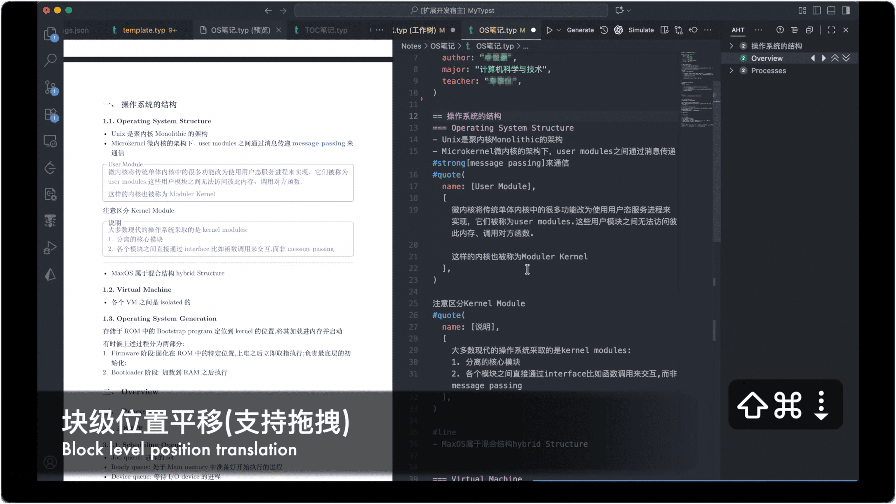

[English Guide](#english-guide) | [Github Repo](https://github.com/ffy6511/Adjust-heading-in-tree.git)

  

Adjust Heading in Tree 是一款针对 Markdown 与 Typst 文档的 VS Code 扩展，提供导航树、拖拽重排与批量层级调整，帮助你像操作“块”一样管理整段内容。

### 功能特性

- **标题结构导航**：在侧边栏展示 Markdown `#` 与 Typst `=` 标题形成的层级树，支持展开、折叠与点击定位；
- **拖拽重排**：在树中拖动标题即可连同子树移动到新位置，保持文档结构一致；
- **同级快速排序**：通过内联按钮或快捷键在同一父级内向上/向下移动标题块；
- **批量层级调整**：整体提升或降低选中标题及其子树的层级；
- **层级显示控制**：使用工具栏按钮设置导航树的最大展开层级；
- **导出子树**：单独将选中的标题子树导出为 PDF 或 PNG 图片，方便分享或进一步处理(需要安装 Tinymist)；

s
  

### 快捷键

| 操作              | Windows / Linux    | macOS             |
| ----------------- | ------------------ | ----------------- |
| 提升标题层级      | `Ctrl + Shift + ←` | `Cmd + Shift + ←` |
| 降低标题层级      | `Ctrl + Shift + →` | `Cmd + Shift + →` |
| 向上移动（同级）  | `Ctrl + Shift + ↑` | `Cmd + Shift + ↑` |
| 向下移动（同级）  | `Ctrl + Shift + ↓` | `Cmd + Shift + ↓` |
| 显示 / 隐藏导航栏 | `Ctrl + Shift + T` | `Cmd + Shift + T` |

> 所有快捷键都可在 VS Code `Preferences → Keyboard Shortcuts` 中自定义。“Adjust Heading Tree Help” 按钮可快速打开对应设置。

### 许可

MIT License

## English Guide

Adjust Heading in Tree is a VS Code extension for Markdown and Typst documents. It provides navigation trees, drag-and-drop rearrangements, and batch hierarchy adjustments so you can manage entire sections like modular blocks.

### Features

- **Title structure navigation**: Display the heading hierarchy formed by Markdown `#` and Typst `=` in the sidebar, with expand, collapse, and click-to-jump support.
- **Drag-and-drop reorder**: Move a heading and its subtree to a new location while preserving document structure.
- **Peer-level quick sort**: Use inline buttons or shortcuts to move a heading block up or down within the same parent.
- **Batch hierarchy shift**: Promote or demote selected headings together with their subtrees in one action.
- **Hierarchy depth control**: Set the maximum expanded level of the navigation tree via toolbar buttons.
- **Subtree export**: Export a heading subtree as a PDF or PNG image for sharing or further processing(requires Tinymist).

  

### Shortcuts

| Action                 | Windows / Linux    | macOS             |
| ---------------------- | ------------------ | ----------------- |
| Promote heading level  | `Ctrl + Shift + ←` | `Cmd + Shift + ←` |
| Demote heading level   | `Ctrl + Shift + →` | `Cmd + Shift + →` |
| Move up (same level)   | `Ctrl + Shift + ↑` | `Cmd + Shift + ↑` |
| Move down (same level) | `Ctrl + Shift + ↓` | `Cmd + Shift + ↓` |
| Toggle tree visibility | `Ctrl + Shift + T` | `Cmd + Shift + T` |

> All shortcuts can be customized via VS Code `Preferences → Keyboard Shortcuts`. The "Adjust Heading Tree Help" command opens the relevant settings instantly.

### License

MIT License
